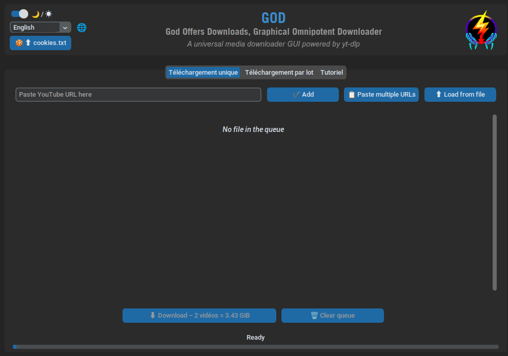
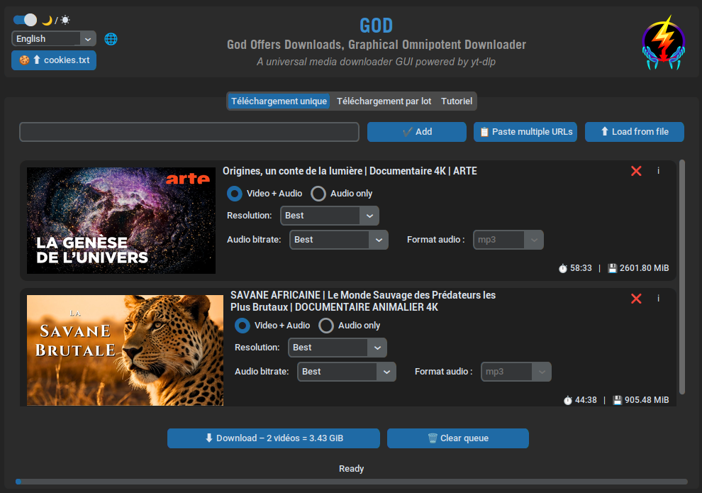
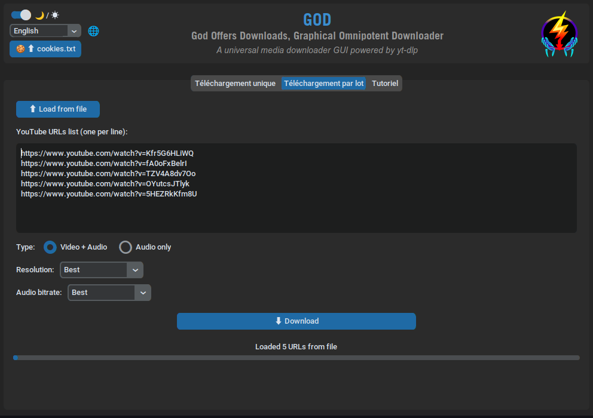

# GOD  
[](LICENSE.md) [](https://www.python.org/downloads/) [](https://github.com/TON_USERNAME/GOD)

A universal media downloader with a modern Python GUI, powered by **yt-dlp**.

Download media from YouTube, Instagram, Facebook...

------



## 🧠 About the Name

GOD stands for:

**GOD Offers Downloads**

or

**Graphical Omnipotent Downloader**

Yes, it's recursive. Yes, it's intentional. Yes, I couldn't decide among both acronyms ;). Pick your fav' !

---

## 🚀 Introduction

**GOD** is a cross-platform graphical application designed to make media downloading simple, powerful, and accessible to everyone.

Thanks to **yt-dlp**, GOD supports **hundreds of websites**, not only YouTube, and provides an intuitive **CustomTkinter-based GUI** to manage downloads without using the command line.

The application is built for both casual users and advanced users who want fine control over formats, resolutions, and audio quality.

---

## ✨ Features

- 🎥 **Video Download**: Multiple resolutions (4K, 1080p, 720p, etc.)
- 🎵 **Audio Extraction**: MP3 or M4A with bitrate selection
- 📋 **Batch Download**: Multiple URLs at once
- 🔒 **Private Playlists Support**: Via Firefox cookies or cookies.txt file
- 🌍 **Multilingual**: 15 languages available (EN, FR, ES, DE, AR, BR, etc.)
- 🌓 **Dark/Light Theme**: Modern and customizable interface
- 📖 **Built-in Tutorial**: Complete guide within the app
- 🖥️ User Interface: No command-line interaction required

---

## 🛠️ Requirements & Development

### Technology Stack

- **Python 3.10+**
- **yt-dlp** (core downloading engine)
- **CustomTkinter** (modern Tk-based GUI)
- **FFmpeg** (audio/video processing)

### Prerequisites

- Python 3.10 or newer
- pip
- FFmpeg installed and accessible in PATH (for MP3 conversion)

### Installing FFmpeg

**Linux (Ubuntu/Debian)**:

```bash
sudo apt install ffmpeg
```

**macOS (Homebrew)**:

```bash
brew install ffmpeg
```

**Windows (Chocolatey)**:

```powershell
choco install ffmpeg
```

------

## 📦 Installation

🧳 GOD is designed to be packaged as a portable application (e.g. AppImage on Linux, standalone executable on Windows), allowing users to run it without installing Python or virtual environments.

### 🐧 Linux (Recommended: AppImage)

**Method 1: AppImage (no installation required)**

```bash
# Download the latest release
wget https://github.com/richbenji/GOD-God-Offers-Downloads-Graphical-Omnipotent-Downloader-/releases/latest/download/GOD-x86_64.AppImage

# Make it executable
chmod +x GOD-x86_64.AppImage

# Run the application (or double-click on the application)
./GOD-x86_64.AppImage
```

**Method 2: From source**

```bash
# Clone the repository
git clone https://github.com/YOUR_USERNAME/GOD.git
cd GOD

# Create a virtual environment
python3 -m venv venv
source venv/bin/activate

# Install dependencies
pip install -r requirements.txt

# Run the application
python GOD/main.py
```

### 🪟 Windows

**Method 1: Portable executable (no installation required)**

```powershell
# Download GOD.exe from releases
# https://github.com/YOUR_USERNAME/GOD/releases/latest

# Double-click GOD.exe to launch
```

**Method 2: From source**

```powershell
# Clone the repository
git clone https://github.com/YOUR_USERNAME/GOD.git
cd GOD

# Create a virtual environment
python -m venv venv
venv\Scripts\activate

# Install dependencies
pip install -r requirements.txt

# Run the application
python GOD\main.py
```

### 🍎 macOS

**Method 1: Application bundle (.app)**

```bash
# Download GOD.app.zip from releases
# https://github.com/YOUR_USERNAME/GOD/releases/latest

# Extract and move to Applications
unzip GOD.app.zip
mv GOD.app /Applications/

# Launch from Launchpad or Applications
```

**Method 2: From source**

```bash
# Clone the repository
git clone https://github.com/YOUR_USERNAME/GOD.git
cd GOD

# Create a virtual environment
python3 -m venv venv
source venv/bin/activate

# Install dependencies
pip install -r requirements.txt

# Run the application
python GOD/main.py
```

------

## 🚀 Quick Start

A full tutorial is available in the "Tutorial" tab of the app.

### Main Interface

1. **Paste the URL** in the input field, or load from a file containing multiple URLs( one per line) or paste multiple URLs
2. **Click "Add"** to load video information
3. **Choose** your options (resolution, audio format, etc.)
4. **Click "Download"** and select the destination folder

### Download Modes

#### 🎯 Single Download

- Customize each video individually
- Display thumbnails and detailed information
- Support for public and private playlists



#### 📦 Batch Download

- Download multiple videos with the same settings
- Paste multiple URLs (one per line)
- Or import a `.txt` file containing your URLs



### 🍪 Private Playlists

**Automatic method (Firefox)**:

1. Log in to YouTube in Firefox
2. The app automatically uses your cookies
3. ✅ No additional manipulation needed!

**Manual method**:

1. Install an extension: [cookies.txt](https://addons.mozilla.org/firefox/addon/cookies-txt/)
2. Export your YouTube cookies in Netscape format
3. Click "🍪 ⬆️ cookies.txt" in the app
4. Select your `cookies.txt` file

------

## 🤝 Contributing

Contributions are welcome!

### How to participate

1. **Fork** the project
2. **Create** a branch for your feature (`git checkout -b feature/AmazingFeature`)
3. **Commit** your changes (`git commit -m 'Add some AmazingFeature'`)
4. **Push** to the branch (`git push origin feature/AmazingFeature`)
5. **Open** a Pull Request

### Appreciated Contribution Types

- 🐛 Bug fixes
- ✨ New features
- 🌍 Additional translations
- 📖 Documentation improvements
- 🎨 Interface enhancements

------

## ⚠️ Legal Disclaimer

This project is intended for personal and educational use only.
Please respect the terms of service of the websites you download content from, as well as copyright laws applicable in your country.

**You are responsible** for how you use it:

- ✅ **Authorized**: Download your own videos, content under free license, or content you have permission for
- ❌ **Prohibited**: Download copyrighted content without permission, redistribute downloaded content

> **Important**: Always respect [YouTube's Terms of Service](https://www.youtube.com/t/terms) and copyright laws in your country.

------

## 📜 License

This project is open-source and distributed under the MIT License. See the [LICENSE.md](LICENSE.md) file for details.

------

## ❤️ Acknowledgments

- [yt-dlp](https://github.com/yt-dlp/yt-dlp) - The download engine
- [CustomTkinter](https://github.com/TomSchimansky/CustomTkinter) - The modern GUI framework
- [FFmpeg](https://ffmpeg.org/) - Audio/video conversion
- All the contributors who make this project better

------

## THANK YOU FOR USING GOD

**If you find this project useful, please give it a ⭐!**

**Happy downloading! 🎉**

Made with ❤️ by Richard